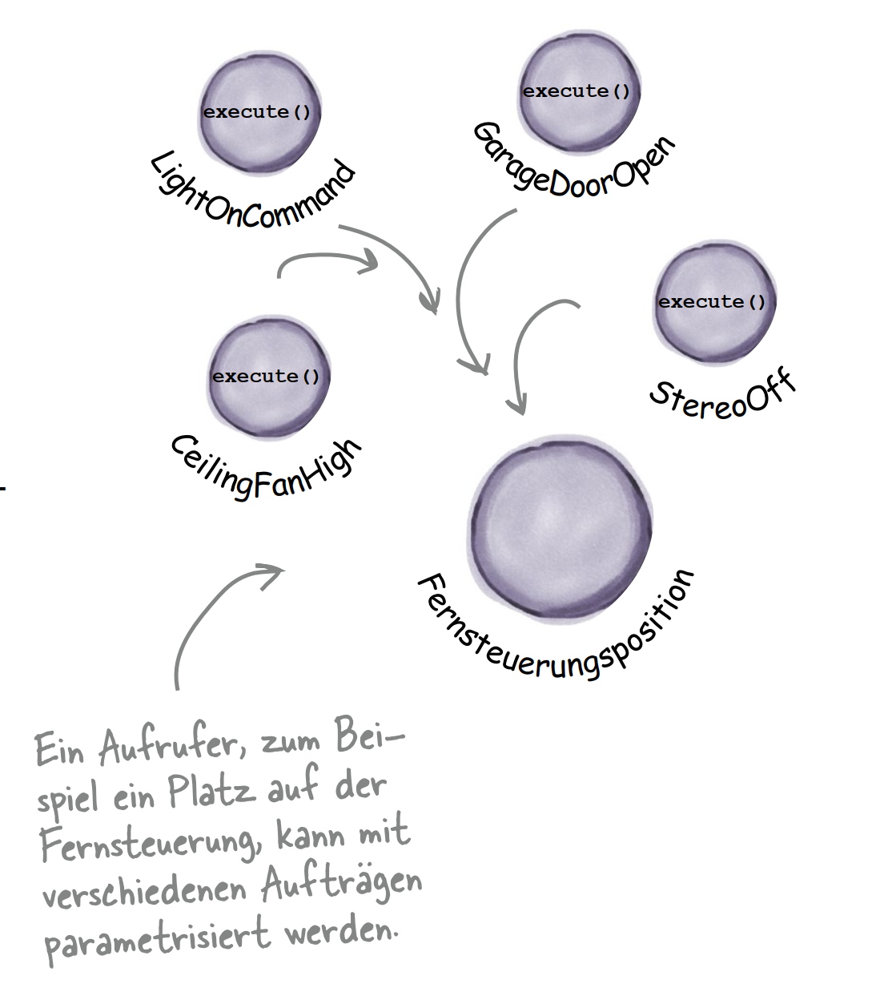
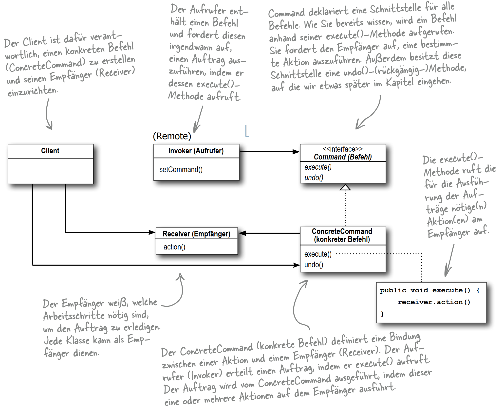
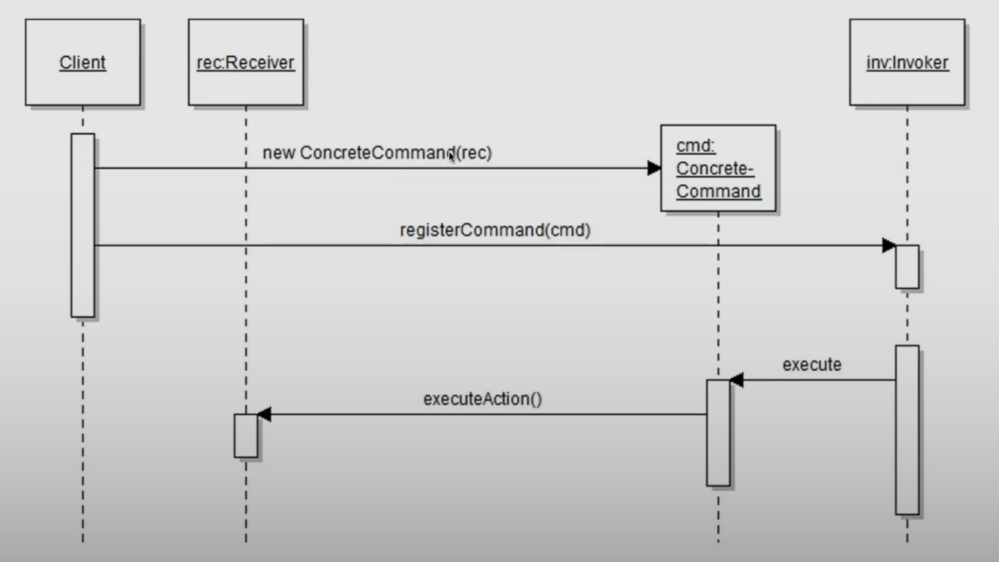
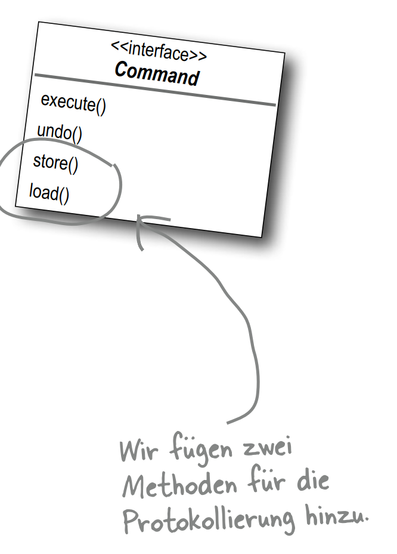
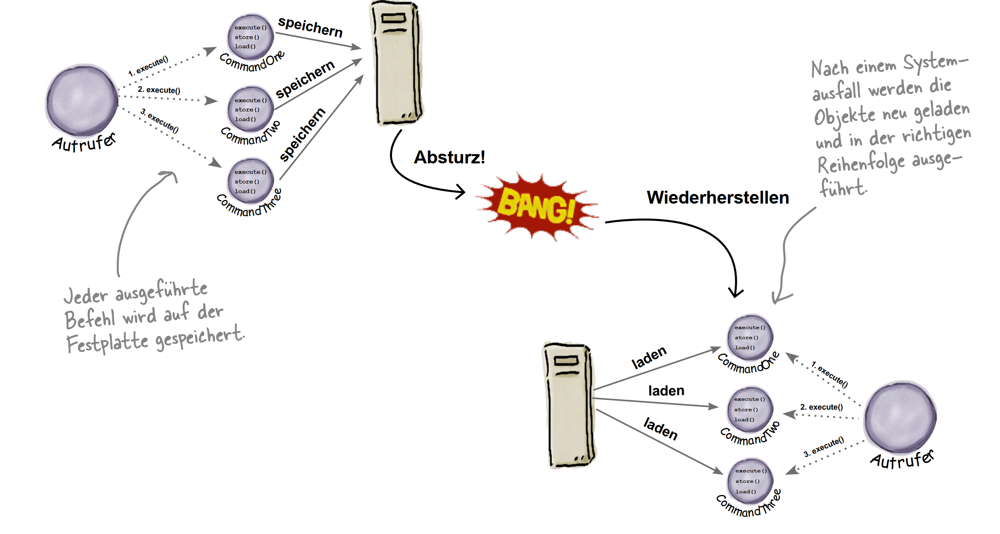
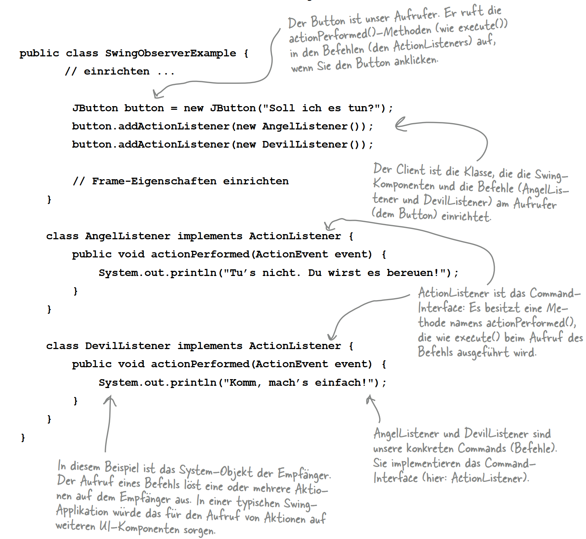
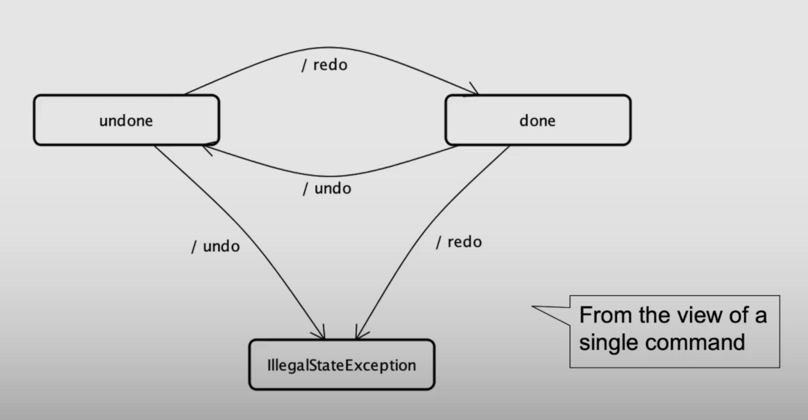
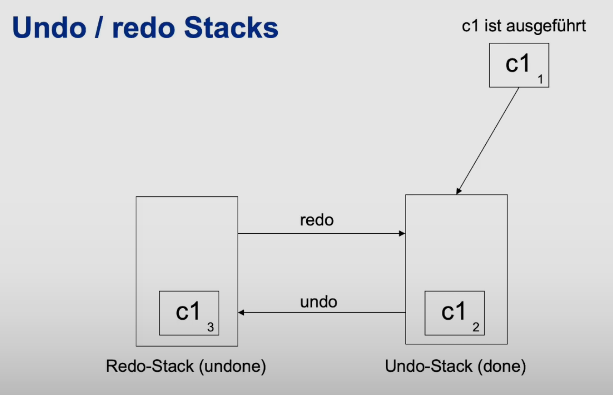

## Command Pattern

```text
Das Command-Muster verkapselt einen Auftrag in
einem Objekt und ermöglicht es dadurch, andere Objekte mit verschiedenen Aufträgen zu parametrisieren,
Aufträge in Warteschlangen einzureihen oder zu protokollieren oder das Rückgängigmachen von Operationen
zu unterstützen.
```






### Makro Commands
Makro-Befehle sind eine einfache
Erweiterung des Command-Musters, mit dem mehrere Befehle
aufgerufen werden können. Auch für
Makro-Befehle lässt sich leicht eine
Unterstützung für undo() implementieren

### Protokollieren




### Command & Observer Pattern combined


### Undo & Redo




Falls ein neuer Command dem Undo-Stack hinzugefügt wird, muss der
Redo-Stack gelöscht werden. (Nichts zu wiederholen da wir nicht
zurückgegangen sind) 
