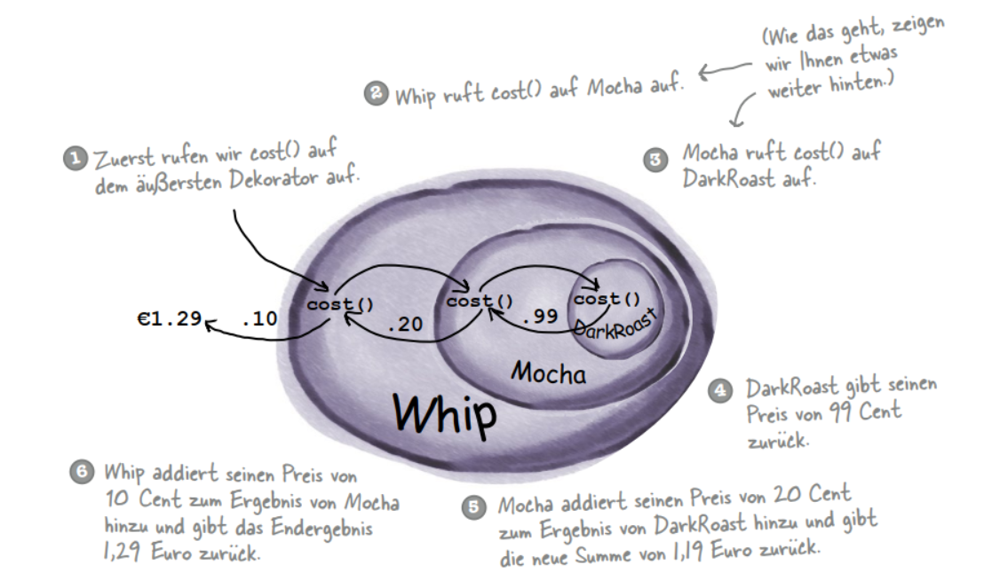
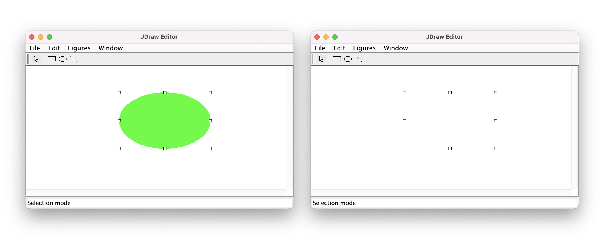
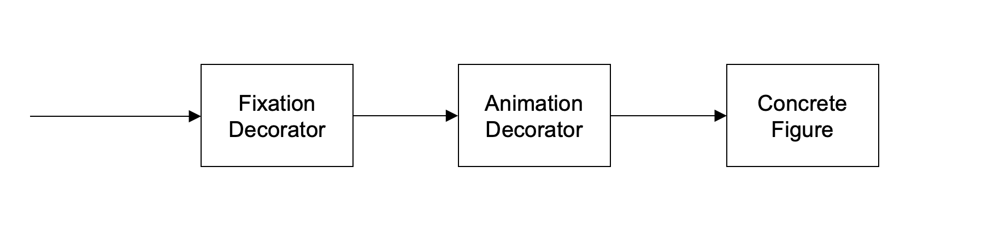
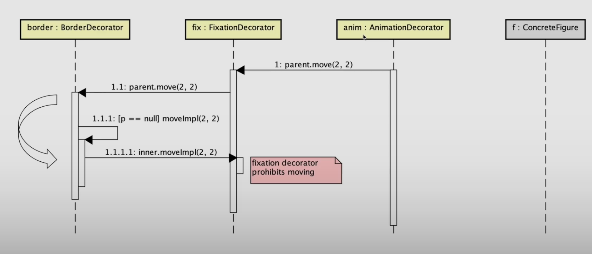
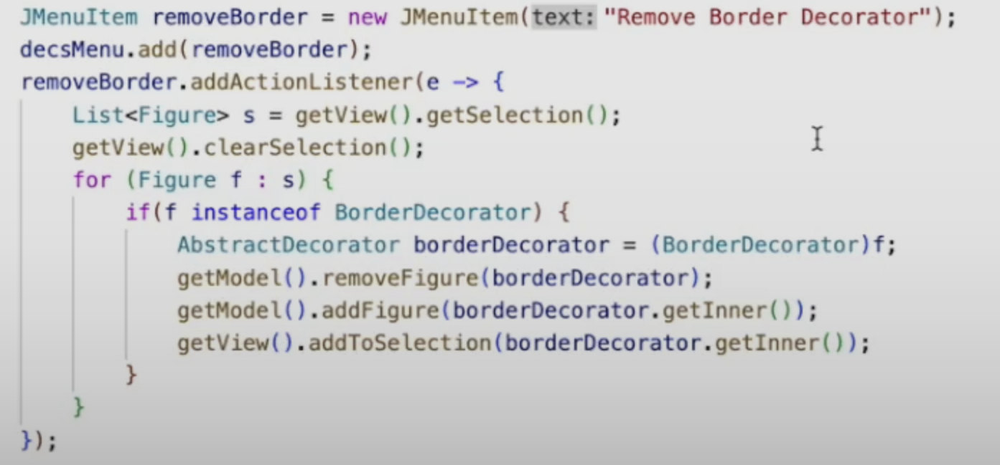

## Decorator Pattern

- Dekoratoren besitzen den gleichen Supertyp wie die von ihnen dekorierten Objekte.
- Sie können ein Objekt mit mehreren Dekoratoren umgeben.
- Da der Dekorator den gleichen Supertyp hat wie das von ihm dekorierte Objekt, können
wir ein dekoriertes Objekt anstelle des »verpackten« Originalobjekts weitergeben.
- Der Dekorator fügt sein eigenes Verhalten vor und/oder nach der Delegation an das
von ihm dekorierte Objekt hinzu, um den Rest der Aufgabe zu erfüllen.
- Objekte können jederzeit dekoriert werden. Das heißt, Objekte können zur Laufzeit
dynamisch mit beliebig vielen Dekoratoren versehen werden

``` text
Das Decorator-Muster erweitert ein Objekt dynamisch um weitere Verantwortlichkeiten. 
Dekoratoren bieten eine flexible Alternative zu Subklassen für die Erweiterung der Funktionalität.
```




## Aspekte 

### 1. Gruppenfiguren
Wenn Sie eine Figur mit dem Green-Decorator versehen und dann zusätzlich noch mit einem Rahmen-Decorator,
erwarten Sie dann, dass Sie auf dieser Figur den Green-Decorator wieder entfernen können, ohne dass der Rahmen verschwindet?
#### Lösung: Gruppenfiguren innerhalb der Kette erkennen mit Type Tests
#### Danach können Gruppenfiguren entpackt werden
Wenn keine Funktionen in den Decoratoren dafür vorprogrammiert wurden, ist es nicht möglich einzelne Decoratoren
aus der Kette zu nehmen. Notwendige Funktionen:
```java
// Concrete Component:
	@Override
	public final boolean isInstanceOf(Class<?> type) {
		return type.isAssignableFrom(this.getClass()); // Test if gleicher Typ oder Subtyp
	}
	@Override
	public final <T> T getInstanceOf(Class<T> type) {
		return type.cast(this); // checked version of (T)this
	}

// Abstract Decorator:
	@Override
	public final <T> T getInstanceOf(Class<T> type) {
		if(type.isAssignableFrom(this.getClass())){
			return type.cast(this); // checked version of (T)this
		} else {
			return inner.getInstanceOf(type);
		}
	}
	@Override
	public final boolean isInstanceOf(Class<?> type) {
		return type.isAssignableFrom(this.getClass()) || inner.isInstanceOf(type);
        // Falls type.isAssignableFrom(this.getClass()), false ist,
        // Wird weitergeleitet an inner. Somit wird Kette durchlaufen bis ein Component true zurückgibt
	}
```
Somit kann die Kette geprüft werden, ob sich ein AnimationDecorator sich darin befindet.
Danach kann der spezifische Decorator geholt werden und mit getInstanceOf().
```text
FixationDecorator.isInstanceOf(AnimationDecorator) == True
```

### 2. Falscher Owner bei dekorierten Objekten
Dekorieren Sie eine Figur und löschen Sie diese anschliessend. Sie werden dann folgendes Bild sehen:


Obwohl die Handles bei der Entfernung der Selection entfernt werden, werden die Handles nicht gelöscht.
Dies passiert weil beim Aufruf von getOwner() auf die Handles dieses verketteten Objekts, der Owner Oval 
zurückgegeben wird und nicht der Decorator. 
#### Lösung 1 equals:
- equals() implementieren im **Decorator** welches durch die ganze Kette geht.
```java
@Override
public boolean equals(Object that) {
    return this == that || inner.equals(that);
}
```
#### Lösung 2 another Decorator:
Im **Decorator** in Funktion getHandles() die Handles dekorieren mit einem neuen Dekorator (HandleDecorator)
```java
public List<Handles> getHandles() {
    return inner
        .getHandles()
        .stream()
        .map(handle -> new HandleDecorator(this, handle)) //Dekorieren mit another Decorator
        .toList()
}
```
**HandleDecorator**
```java
public class HandleDecorator implements FigureHandle {
    FigureHandle inner;
    Decorator decorator;
    
    public HandleDecorator(Decorator decorator, FigureHandle handle) {
        this.decorator = decorator;
        inner = handle;
    }

    @Override
    public Figure getOwner(){
        return decorator;
    }
}

```
### 3. Immer an Anfang der Kette beginnen 
Wenn Sie nun eine Figur mit dem `AnimationDecorator` dekorieren und anschliessend mit dem `FixationDecorator`, so *wandert* die Figur weiterhin umher.

#### Lösung: Dynamic Innvocation
Inside abstract Component, Die Funktionen die dynamic Innvocation benötigen:
```java
//Abstract Component
public void move() {
    if (parent != null) { // Bis zum Anfang der Kette gehen
        parent.move()
    } else {
        moveImpl() // Falls am Anfang angekommen. Wird ja weitergeleitet mit inner.moveImpl()
    }
}
```


Ohne Vererbung muss Parent als Variable vorhanden sein.

### Remove Decorator Example
Zuerst die Figur casten auf den gewünschte Decorator
Danach Objekt (Decorator) entfernen und inner wieder hinzufügen.

