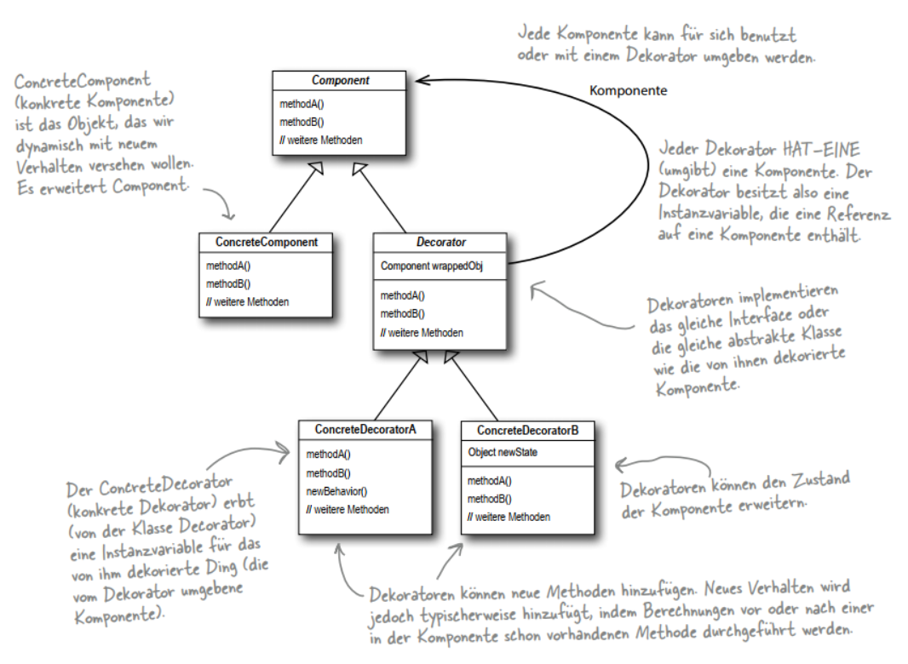

## Prototype Pattern

- Dekoratoren besitzen den gleichen Supertyp wie die von ihnen dekorierten Objekte.
- Sie können ein Objekt mit mehreren Dekoratoren umgeben.
- Da der Dekorator den gleichen Supertyp hat wie das von ihm dekorierte Objekt, können
wir ein dekoriertes Objekt anstelle des »verpackten« Originalobjekts weitergeben.
- Der Dekorator fügt sein eigenes Verhalten vor und/oder nach der Delegation an das
von ihm dekorierte Objekt hinzu, um den Rest der Aufgabe zu erfüllen.
- Objekte können jederzeit dekoriert werden. Das heißt, Objekte können zur Laufzeit
dynamisch mit beliebig vielen Dekoratoren versehen werden

``` text
Das Decorator-Muster erweitert ein Objekt dynamisch um weitere Verantwortlichkeiten. 
Dekoratoren bieten eine flexible Alternative zu Subklassen für die Erweiterung der Funktionalität.
```



