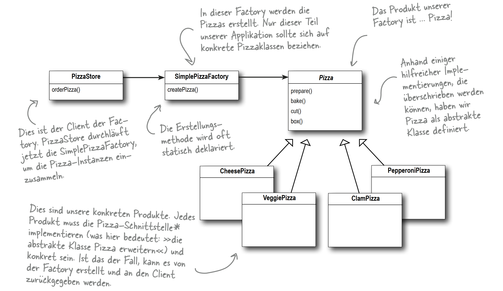

## Factory Pattern

```text
Alle Factory-Muster verkapseln die Objekterstellung. 

Beim Factory Method-Muster funktioniert das, indem die Subklassen entscheiden können, welches Objekt erstellt
werden soll
```

### Simple Factory 
- Package simpleFactory



### Factory Method 
```text
Das Factory Method-Muster definiert eine Schnittstelle zur Objekterstellung, lässt aber 
die Subklassen entscheiden, welche Klassen instanziiert werden. Factory Method ermöglicht einer
Klasse, die Instanziierung in Subklassen zu verlagern.
```
- Package storeAbstract


### Abstract Factory
```text
Das Abstract Factory-Muster bietet eine Schnittstelle zum Erstellen
von Familien verwandter oder zusammenhängender Objekte an, 
ohne konkrete Klassen anzugeben.
```
-> PizzaIngredientFactory


