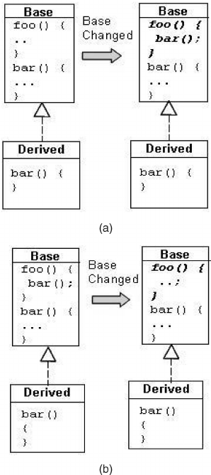

# Fragile Base Class Problem

## Problem
- Falls die Klasse die erweiter wird, sich ändert, führt dies zu Problemen in den Subklassen
falls diese in einem anderen Packet sind.
Vorallem beim Überschreiben vom Methoden.




## Lösung 
- Anstatt eine bestehende Klasse zu erweitern, geben Sie Ihrer neuen
Klasse ein privates Feld, das auf eine Instanz der bestehenden Klasse verweist.
- Dieses Design wird als Komposition bezeichnet, weil die bestehende Klasse zu einer Komponente der neuen wird. 
- Jede Instanzmethode in der neuen Klasse ruft die entsprechende Methode auf der enth
  altenen Instanz der bestehenden Klasse auf und gibt die Ergebnisse zurück. Dies wird als
  Weiterleitung (Forwarding) bezeichnet, und die Methoden der neuen Klasse
  Weiterleitungsmethoden genannt.

### Callbacks aus der Basisklasse erkennen / ignorieren
````java
//Callbacks nicht zählen mittels Callstack & Stackframes
@Override
public void write(char ch) throws IOException {
    int temp = ++counter;
    super.write(ch); // Erzeugt Callback welcher ignoriert wird (counter)
    counter = temp;
}

@Override
public void write(String s) throws IOException {
    int temp = counter + s.length();
    super.write(s); // Erzeugt Callback welcher ignoriert wird (counter)
    counter = temp;
}
````

### Callbacks erkennen via boolean
````java
private boolean invoked; // Callbacks nit zählen mittels boolean

@Override
public void write(char ch) throws IOException {
    if(!invoked) {
        invoked = true;
        super.write(ch);
        counter++;
        invoked = false;
    } else {
        super.write(ch);
    }
}

@Override
public void write(String s) throws IOException {
    if(!invoked) {
        invoked = true;
        super.write(s);
        counter += s.length();
        invoked = false;
    } else {
        super.write(s);
        }
}
````
### Mit Decorator Pattern
- Counter in der Decorator-Klase zählen und alles andere an INNER weiterleiten

## Real World 
- Beispielsweise stellt Guava Weiterleitungsklassen für alle Sammlungs-Schnittstellen Guava bereit.
- In den Java-Plattform-Bibliotheken wird gegen dieses Prinzip wiederholt ver-
  stoßen. Zum Beispiel ist ein Stack kein Vektor, daher sollte die Klasse Stack nicht die Klasse Vector erweitern. 
Ebenso ist eine Ei genschaftsliste keine Hashtabelle, sodass Properties nicht Hashtable erweitern sollte. 
In beiden Fällen hätte man eine Komposition vorziehen sollen. 
- Es gibt noch ein paar letzte Fragen, die Sie sich stellen sollten, bevor Sie der Vererbung den Vorzug vor der Komposition geben. 
  Hat die Klasse, die Sie zu erweitern gedenken, irgendwelche Fehler in ihrer API? Wenn ja, fühlen Sie sich
  wohl damit, diese Fehler in die API Ihrer Klasse zu übernehmen? Bei der Verer-
  bung werden alle Fehler in der API der Superklasse weitergereicht, während Sie
  bei Komposition eine neue API entwerfen können, die diese Fehler verbirgt.
