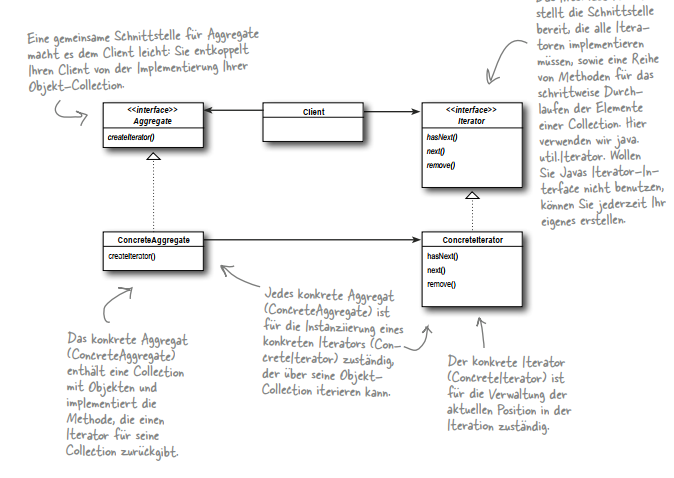

# Iterator
## Formal Definition 
``` text
Ein Iterator ermöglicht den Zugriff auf die Elemente eines Aggregats, ohne dessen interne Struktur zu offenbaren.
```


## Notes Example
- 2 Restaurants fusionieren und beide haben verschiedene Implementierungen ihrer Speisekarte (1x ArrayList PancakeHouse, 1x Array Diner)
- Iterator wird benötigt, um damit Waitress über beide Speisekarten iterieren kann, ohne die interne Struktur der Speisekarten zu kennen.

## Nice To Know
