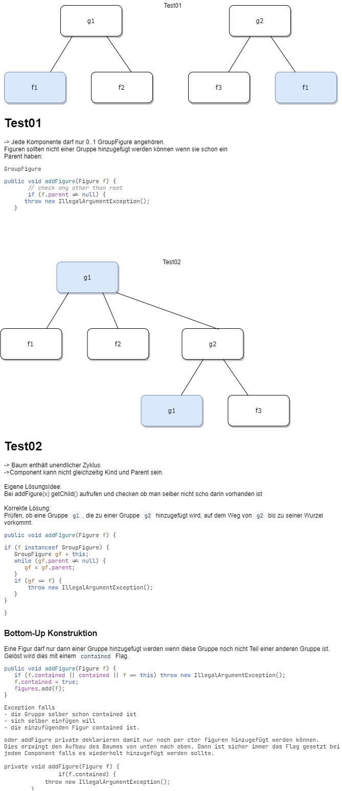

# Composite
## Formal Definition 
``` text
Baum Struktur
Das Composite-Muster schafft die Möglichkeit, dass Clients Komposita und Einzelobjekte auf die gleiche Weise behandeln.
```


## Notes Example
- Jedes Objekt in einer KompositStruktur ist eine Komponente. Komponenten können selbst Komposita oder Blätter sein
- Nicht alle Subklassen von abstract MenuComponent werden alle Methoden sinnvoll implementieren können. -> Werfen Exception wenn aufgerufen

## Nice To Know 



### TRANSPARENT vs SAVE
- Composite-spezifischen Methoden in Composite-Klasse: **SAVE** *favorisiert Typsicherheit und Klarheit*
- Composite-spezifischen Methoden in Component-Klasse: **TRANSPARENT**. *favorisiert Transparenz und Einheitlichkeit.* 
<br>*Man soll nicht unterscheiden müssen, ob es sich um ein Composite oder Component handelt.*

Ein grosser Vorteil am transparenten Ansatz ist, dass wir nicht unterscheiden müssen, ob wir uns gerade ein Composite oder ein Leaf-Objekt anschauen. Da alle Methoden auf dem Composite definiert sind, ist die Schnittstelle für alle Objekte uniform.

Wie immer gibt es auch Nachteile. Ein wichtiger ist sicher: Wie wollen wir Methoden implementieren, die auf einem konkreten Objekt keinen Sinn machen. Wie soll also z.B. `add(Component c)` auf dem Leaf implementiert werden? In der folgenden Reflexion behandeln wir genau dieses Thema.

Zur Diskussion steht die Implementation der folgenden Composite-Spezifische Methoden auf dem Leaf:
```text
add(Component c)
remove(Component c)
getComponents()
```

## Variante 1: Die Methoden werfen eine UnsupportedOperationException
```java
public void add(Component c){throw new UnsupportedOperationException();}
public void remove(Component c){throw new UnsupportedOperationException();}
public List getComponents(){return Collections.EMTPY_LIST;}
```
**Nachteil**: Man braucht zusätzlich eine Möglichkeit, um zu testen ob es sich bei einem Objekt um ein Composite handelt oder nicht, denn eine Ablaufkontrolle mit Exceptions ist nicht schön und sehr ineffizient.

## Variante 2: Methoden signalisieren Status
Die Methoden `add`/`remove` geben als Resultat ein `boolean` zurück, welches angibt, ob die Methode erfolgreich war oder nicht. Mit dem Aufruf `getComponents().size()` kann geprüft werden, ob in einem Component Objekt Elemente enthalten sind. Man kann jedoch nicht abfragen, ob es sich um ein Composite oder ein Leaf handelt, ausser man fügt eine Komponente hinzu (Aufruf von `add`).
```java
public boolean add(Component c) { return false; }
public boolean remove(Component c) { return false; }
public List getComponents() { return Collections.EMTPY_LIST; }
```

## Variante 3: isComposite Flag
Es gibt eine Methode `isComposite()` mit der man prüfen kann, ob es sich bei der Komponente um eine Gruppe handelt oder nicht. Bei den Methoden `add`/`remove` würde in der Vorbedingung stehen, dass diese Methoden nur aufgerufen werden dürfen falls `isComposite()` gilt. Der Vorteil gegenüber der SAFE Lösung ist, dass man so die Operationen immer noch über alle Komponenten anwenden kann.
```java
public boolean isComposite(){ return false; }
public boolean add(Component c){ throw new AssertionError(); }
public boolean remove(Component c){ throw new AssertionError(); }
public List getComponents(){return Collections.EMTPY_LIST;}
```

## Variante 4: Neutrales Verhalten
Die Methoden haben ein Defaultverhalten, das neutral ist.
```java
public void add(Component c){ /* do nothing */ }
public void remove(Component c){ /* do nothing */ }
public List getComponents(){return Collections.EMTPY_LIST;}
```
`getComponents` muss somit eine leere Liste zurückliefern, denn ein null wäre nicht neutral und könnte beim Aufrufer zu einer `NullPointerException` führen. In dieser Variante **kann** und will der Aufrufer gar nicht unterscheiden zwischen Composite und Component.

## Variante 5: Funktionaler Ansatz
Die Methode `add` würde ein Leaf-Objekt zu einem Composite-Objekt konvertieren, oder wenn man das zweitletzte Element einer Gruppe entfernt, dann kommt das letzte Element wieder als Leaf zurück.
```java
public Component add(Component c){ 
   if(c instanceof Composite) {
       return c.add(this);
   }
   return new Composite(this, c);
}
public void remove(Component c){ ... }
public List getComponents(){return Collections.EMTPY_LIST;}
```

## Variante 6: Volle Funktionalität
Implementierung der vollen Funktionalität auch in den Component-Klassen (wobei es dann eigentlich keine Komponenten mehr sind, sondern auch Composites. Die Leaf-Objekte sind dann alle von Composite abgeleitet. In Java Swing ist das z.B. so implementiert.


## Reflexion
Die Varianten 1-3 scheinen eher ein Hinweis dafür zu sein, dass man eine SAFE-Implementation in Betracht ziehen sollte. Eine TRANSPARENT-Implementation nur dann *transparent* sein, wenn Variante 4 gewählt wird. Eine der ursprünglichen Motivationen für TRANSPARENT war doch, dass man nicht unterscheiden möchte zwischen Composite und Component.

Will man die Transparenz nur an einigen Stellen und an anderen nicht, dann könnte man Variante 3 mit Modifikationen wählen:
```java
public boolean isComposite(){ return false; }
public void add(Component c){ /* do nothing */ }
public void remove(Component c){ /* do nothing */ }
public List getComponents(){return Collections.EMTPY_LIST;}
```
Spannend ist sicher auch die Variante 5: Diese Lösung orientiert sich an einem funktionalen Ansatz. Hier würde man mit dem Resultat aus dem Methodenaufruf weiterarbeiten. Diese Lösung ist dann wirklich transparent.
