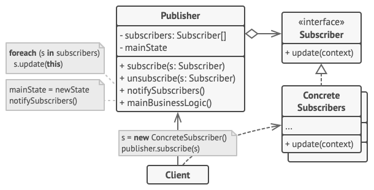

# Observer Pattern
## Formal Definition 

## Different update versions
- **update()** - ohne Parameter | Nur Pull-Modell. Extrem einfach. Der geänderte Zustand muss vom Observer beim Observable abgefragt
werden. 
- **update(Observable s, Color c)** - mit Absender (s) und/oder - Information über neuen Zustand | Einfach. Problematisch zu erweitern falls Argumente einzeln als Parameter auftreten 
- **update(Observable s, Object args)** - mit Absender (s) und/oder - Information über Änderung (args) | Einfach. Über das Objekt args kann die Änderung beschrieben werden oder der neue Zustand kann
übermittelt werden. Sehr gut erweiterbar
- **update(Event e) / update(Message msg)** - mit einem Meldungsparameter | Ein einziges Objekt kapselt alle notwendigen Informationen. Im Code etwas umständlicher zu
programmieren. Sehr gut erweiterbar. 

## Nice To Know
- Wenn alle Listener/Observer auf die Anderungen aller Observables aufmerksam gemacht werden wollen kann ein ¨
Mediator verwendet werden um die Bnachrichtigungen weiterzuleiten.
- An- und Abmeldung w¨ ahrend einer Benachrichtigung sollte m¨ oglich sein. → Iteration uber Kopie oder Kopie bei ¨
An- und Abmeldung (CopyOnWriteArrayList).
- Wenn Observer nicht deregistriert werden, fuhrt das zu Memory-Leaks. ¨
- Benachrichtigung nur dann ausl¨ osen, wenn sich der Wert des Observable ver¨ andert hat.
- Ubereifrige Benachrichtigungen sollten vermieden werden, da sie zu unerwarteten Zust ¨ ¨ anden fuhren k ¨ ¨ onnen.
- Zustands¨ anderungen w¨ ahrend einer Benachrichtigung kann unerwartete Nebeneffekte durch unbeabsichtigte Ausfuhrun ¨
zur Folge haben.

