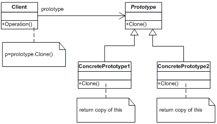
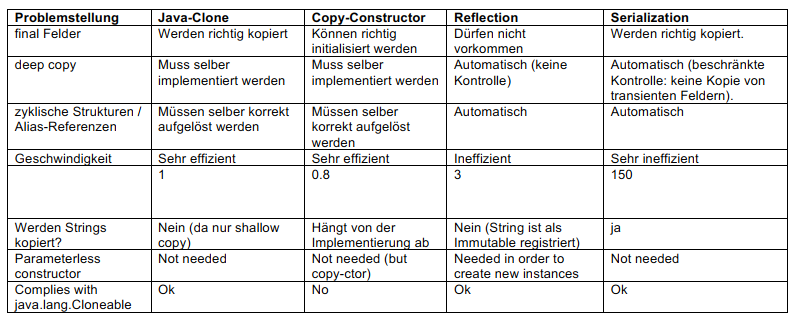

## Prototype Pattern
``` text
Verwenden Sie das Prototype-Muster, wenn die Erstellung einer Instanz einer bestimmten Klasse entweder aufwendig oder kompliziert ist.
```


## Nice To Know
Joshua Bloch, Effective Java (2018)
- Unveränderliche Klassen sollten niemals eine clone -Methode bereitstellen, da es nur zu aufwendigem Kopieren verleitet.
- Wenn die clone -Methode nur super.clone() zurückliefert, wird die resultierende Stack -Instanz in ihrem size -Feld zwar den korrekten Wert aufweisen, ihr elements -Feld jedoch wird auf das gleiche Array zeigen wie die ursprüngliche Stack -Instanz. Eine Änderung des Originals wird die Invarianten des Klons zerstören und umgekehrt.
- Wenn das elements -Feld als final deklariert wäre, da die clone -Methode diesem Feld dann keinen neuen Wert zuweisen dürfte
- Vererbbare Klasse sollte keinesfalls Cloneable implementieren. Wenn Sie sich dafür entscheiden, das Verhalten von Object nachzuahmen, implementieren Sie eine ordentlich funktionierende geschützte clone -Methode, die per Deklaration eine CloneNotSupportedException wirft. Dadurch haben Subklassen die Freiheit, Cloneable zu implementieren, genauso als wenn sie Object direkt erweitern würden.
- Klassen, die Cloneable implementieren, clone mit einer öffentlichen Methode überschreiben sollten, deren Rückgabetyp die Klasse selbst ist. Diese Methode sollte zuerst super.clone aufrufen und dann alle Felder reparieren, die dies erfordern. In der Regel bedeutet
  dies, alle veränderlichen Objekte zu ko pieren, die die intern e »tiefe Struktur« des Objekts aufweisen, und die Referenzen des Klons auf diese Objekte durch Referenzen auf ihre Kopien zu ersetzen. Eine nennenswerte Ausnahme zu dieser Regel bil- den Arrays, die am besten mit der clone -Methode kopiert werden.
### Java clone
```java
@Override public Stack clone() {
   try {
      Stack result = (Stack) super.clone();
      result.elements = elements.clone();
      return result;
   } catch (CloneNotSupportedException e) {
      throw new AssertionError();
   }
}
```
- Ein besserer Ansatz zum Kopieren von Objekten ist die Bereitstellung eines Kopierkonstruktors oder einer Kopier-Factory.
### Copy Ctor
```java
// Kopierkonstruktor
public Yum(Yum yum) { ... };
// Kopier-Factory
public static Yum newInstance(Yum yum) { ... };
```
- Copy Konstruktoren müssen super(<Object>) aufrufen falls von einer Klasse extendet. -> Siehe Klasse [PartTimeEmployee](../example/copy/PartTimeEmployee.java)
- Copy Konstruktoren können protected sein da diese nur von der eigenen Klasse aufgerufen werden oder von subklassen.

### Reflective Clone
- http://docs.oracle.com/javase/tutorial/reflect/
```java
public Object clone () {
	return ReflectiveClone.clone(this);
}
```

### Java Serialization Clone
- Java Serialisierung ist bequem. Klassen können serialisierbar gemacht werden, indem das Marker-Interface Serializable implementiert wird.
-  Falls eine Klasse von einer nicht als serialisierbar deklarierten Klasse abgeleitet und als serialisierbar deklariert wird, so muss die Basisklasse einen Default-Konstruktor aufweisen.
```java
public Object clone () {
	try {
		ByteArrayOutputStream out = new ByteArrayOutputStream();
		ObjectOutputStream oout = new ObjectOutputStream(out);
		oout.writeObject(this);
		
		ObjectInputStream oin = new ObjectInputStream(
			new ByteArrayInputStream(out.toByteArray()));
			return oin.readObject();
	}
	catch (Exception e) 	{
		throw new RuntimeException ("cannot clone class");
	}
}
```

## Varianten im Vergleich

