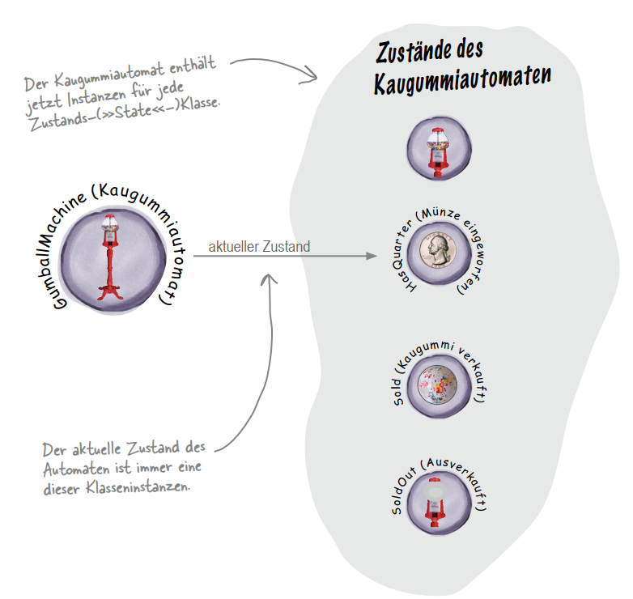
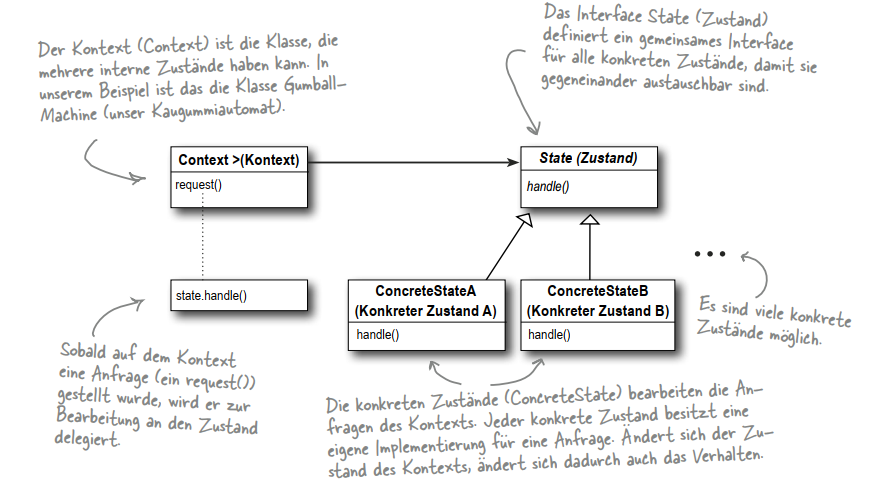

# State Pattern


- Das Verhalten der einzelnen Zustände wurde in separate Klassen ausgelagert.

## Formal Definition


## Zustandsübergänge
#### Als Faustregel gilt: 
```text
Wenn die Zustandsübergänge fest sind, kann
man sie im Kontext platzieren. Sind sie dagegen eher dynamisch,
werden sie typischerweise in den Klassen selbst platziert (beim
Kaugummiautomaten hängt die Wahl der Übergänge zu NoQuarter
oder SoldOut beispielsweise vom Bestand der Kaugummis zur
Laufzeit ab).
```
### State Interface / Abstract Class
```text
Überlegen, ob eine abstrakte Klasse nicht besser passt. Das hat
den Vorteil, dass Sie die abstrakte Klasse später um zusätzliche
Methoden erweitern können, ohne die konkreten Implementierungen der Zustände verändern zu müssen
```
