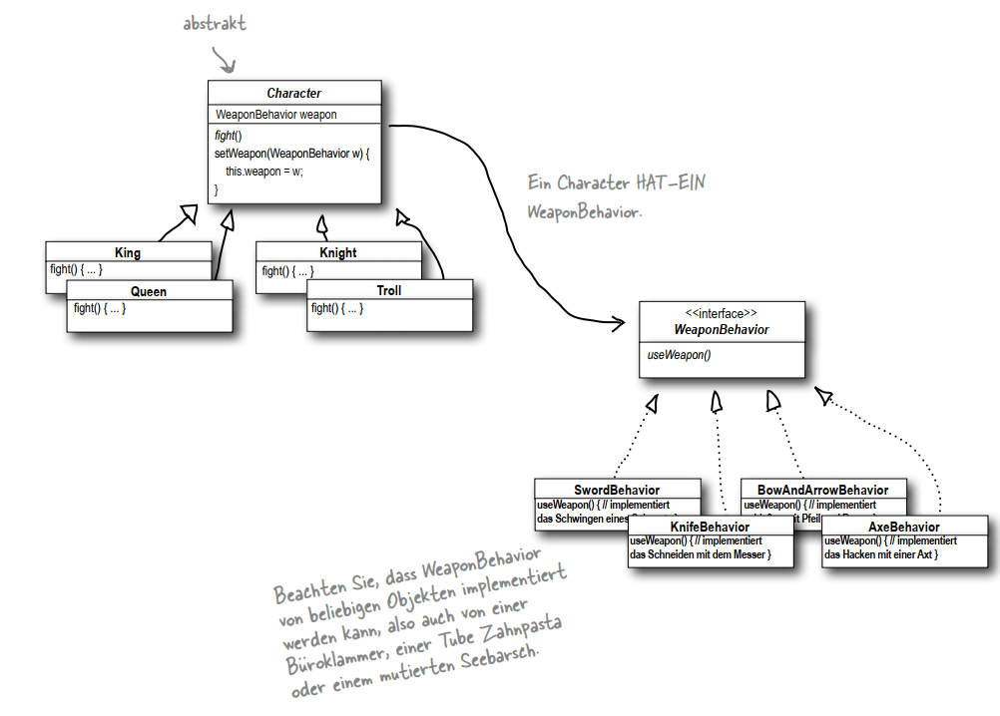

## Formal Definition 
``` text
Das Strategy-Muster definiert eine Familie an Algorithmen, verkapselt sie einzeln und macht sie austauschbar. Das Strategy-Muster ermöglicht es, den Algorithmus
unabhängig von den Clients, die ihn einsetzen, variieren
zu lassen.
```

## Notes 

- **Queen, King, Troll, Knight** IST EIN *Character*
- *Character* HAT EIN *WeaponBehavior*
- *WeaponBehavior* implementiert different **Weapons-Algorithmen**
- Weapons and Character are encapsulated.
- It is possible to change the weapon at Runtime.


